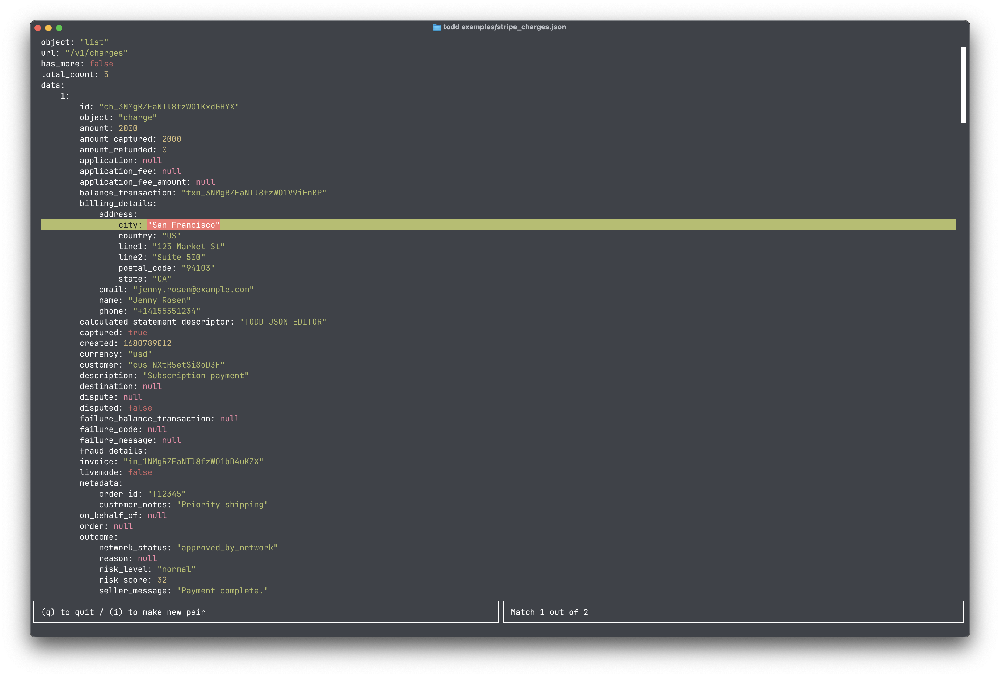

# Todd - Fancy JSON viewer and editor in the terminal
For viewing & searching a json file without opening it in an editor. Todd knows how to represents json files with syntax highlighting and searching.



## Installations
Binaries are provided in the Releases section. If your target computer isn't covered, you can always build from source.

## Usage
```sh
todd my_file.json
```

## Keymap

### Movement
- `j | <Down> | <C-n>`: Moves down one line
- `k | <Up> | <C-p>`: Moves up one line
- `/`: Puts the focus on a searching widget where you can lookup anything in the file (case insensitive)
- `n`: Move to the next match if a search has been applied
- `N`: Move to the previous match if a search has been applied
- `<C-d>`: Scroll half a page down
- `<C-u>`: Scroll half a page up
- `g`: Move to the top of the file
- `G`: Move to the bottom of the file

### Actions
- `i`: Opens the popup for inserting a new key/value pair or a single value if in an array
- `e`: Edit an existing key/value pair or array value at the current cursor position
- `q`: Quits the application

## Contributing
Feel free to open an issue first to discuss what you would like to change.


## License
This project is licensed under the [MIT License](https://choosealicense.com/licenses/mit/). See the [LICENSE](LICENSE) file for details.
